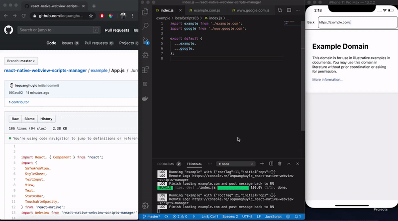

# React Native Webview Scripts Manager

Inspiration from `tampermonkey`, but for React Native Webview. This library will help you manage injected scripts for your Webview component.

# Contents

- [Main Features](#main-features)
- [Demo](#demo)
- [Installation](#installation)
- [Usage](#usage)
  - [Simple Usage](#simple-usage)
  - [Props](#props)
  - [Local Usage](#local-usage)
  - [Remote Usage](#remote-usage)
  - [Remote Console](#remote-console)

# Main Features

- Easily manage multiple sites (locally and remotely)
- Remote debugging included (thanks to [Console.re](https://console.re/))
- jQuery injected by default

# Demo



- take a look at `example` folder

# Installation

```
npm install react-native-webview-scripts-manager --save
```
or
```
yarn add react-native-webview-scripts-manager
```

No linking required

Dependicies: `react-native-webview` ([Linking required](https://github.com/react-native-community/react-native-webview/blob/master/docs/Getting-Started.md))

# Usage

## Simple Usage

```jsx
  import Webview from 'react-native-webview-scripts-manager';

  <Webview
    source={{ uri: this.state.uri }}
    scriptOptions={{
      localScript: localScriptES,
      useLocal: true,
      remoteLogChannel: 'lequanghuylc_react-native-webview-scripts-manager',
    }}
    onRef={ref => this.webview = ref}
  />
```

## Props

| Prop | Description |
|---|---|
|**`scriptOptions`**|Config the injected script manager|
|**`onRef`**|Access the `ref` of raw `react-native-webview` component|
|*The rest of Props*| [React Native WebView Props](https://github.com/react-native-community/react-native-webview/blob/master/docs/Reference.md)|

Let's take a look at `scriptOptions`

| scriptOptions Property | Description |
|---|---|
|**`localScript`**|An `Object` contains injected scripts of multiple sites|
|**`useLocal`**|`Boolean` value to tell if the webview should use local scripts instead of remote scripts|
|**`remoteUrl`**|`String` Will call a `GET` request to receive remote scripts. The response must be `{ success: Boolean, data: Object similar to Localscript Object }`|
|**`remoteHeaders`**|`Custom Header Object` Use for authorization if needed|

The `Scripts Object` is quite simple. Each property must be the href of a website. The value will be its injected script.

```js
  {

    "https://www.google.com/": "console.re.log(\"Hello world, I'm at google.com\");",

    "https://example.com/": "console.re.log(\"Hello world, I'm at example.com\");"

  }
```

We can also use `*` to handle dynamic url:

```js
  {

    "https://example.com/abc/*/def/": "console.re.log(\"Hello world, I'm at a detail page\");"

  }
```

**Note**: For now character `*` wont represent `/` character. So `/a/b/c/*` wont match `/a/b/c/d/f` (it will match `/a/b/c/d`). Any Pull Request to make it smarter is welcomed.

## Local Usage

- Split each script into one js file
- Combined it into one object
- Take a look at `example` folder

## Remote Usage

- For now, this project will only support a `GET` request to receive remote data
- If you want to build an CMS or a nice UI for the ease of script CRUD, do it in your own way. Create an API in the end and pass `remoteUrl` and `remoteHeaders` to fetch the data
- You can use some free services to get it up and running quickly (such as `github`, `myjson.com`, `jsonbin.io` (private json supported))

Example
```jsx
import Webview from 'react-native-webview-scripts-manager';

<Webview
  source={{ uri: this.state.uri }}
  scriptOptions={{
    useLocal: false,
    remoteUrl: `https://raw.githubusercontent.com/lequanghuylc/react-native-webview-scripts-manager/master/example/localScripts.json`,
    remoteHeaders: {
      'Cache-Control': 'no-cache',
    },
    remoteLogChannel: 'lequanghuylc_react-native-webview-scripts-manager',
  }}
  onRef={ref => this.webview = ref}
/>
```

## Remote Console

It will help debugging, because we usually can not see `console.log` when using injected script.

1. specify an unique channel name. put it in `remoteLogChannel`
2. go to `https://console.re/your-given-channel`

Note:
- Only works in development enviroment
- In order to see what it logged, you need to open the website `https://console.re/your-given-channel` first.